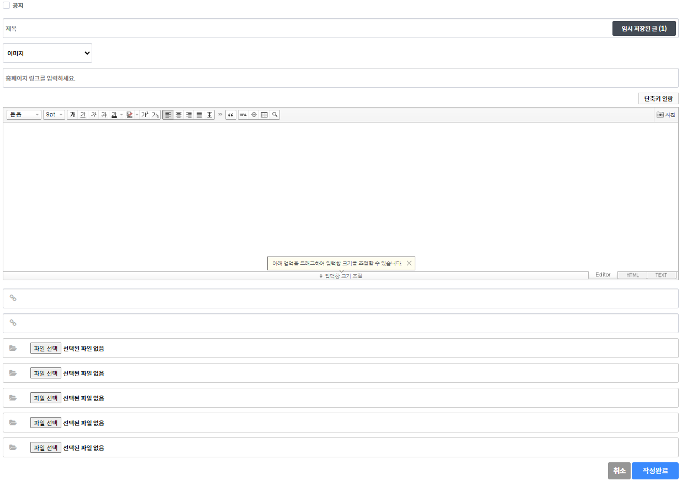
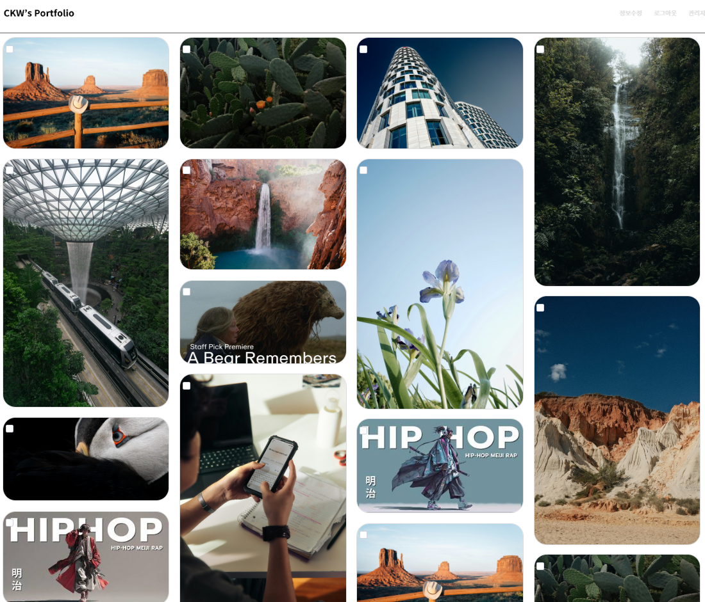
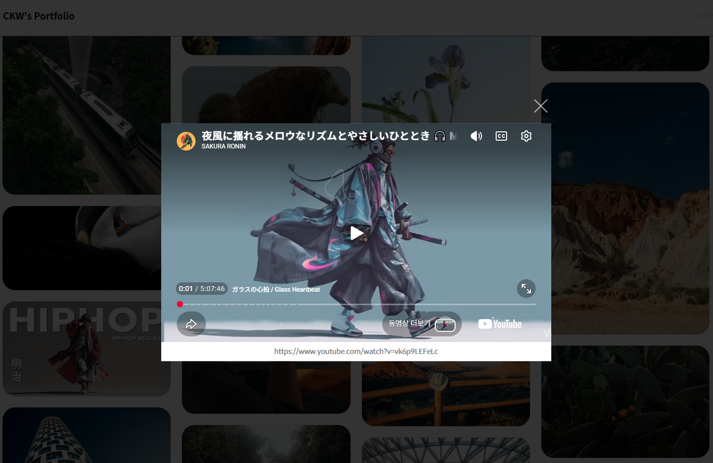

# 프로젝트 이름

무한 스크롤_Masonry 갤러리

## 🔗 데모
[데모 바로가기](https://keewon17.cafe24.com/portfolio/bbs/board.php?bo_table=infinite_scroll)

---

## 📖 소개

그누보드 기반의 Masonry 스타일 무한스크롤 갤러리 게시판 스킨입니다.  
이미지 첨부파일뿐 아니라 YouTube / Vimeo 영상 링크 등록도 지원하며,  
게시글 클릭 시 페이지 이동 없이 모달 팝업으로 콘텐츠를 확인할 수 있습니다.

---

## 🛠 사용 기술

---

## 사용방법 - 매물등록

### 1. 게시글 등록

관리자는 게시글을 등록할 수 있습니다.
유튜브, 비메오, 이미지, 새창 중 하나를 선택하여 등록할 수 있습니다.
유튜브/비메오의 경우 영상 ID를 입력할 수 있으며 썸네일 파일을 등록하지 않아도 자동추출됩니다.
또한 홈페이지 링크를 입력하여 표시할 수 있습니다.

---

## 갤러리 리스트/상세팝업

### 1. 리스트페이지

한 번에 16개의 게시물을 불러오며, 스크롤이 하단에 도달하면 다음 페이지의 게시물 16개를 추가로 로드합니다.(Ajax)
CSS Grid를 사용하여 아이템 크기를 자동 계산하도록 구성했습니다.
이미지 로드 완료 후 grid-row-end 값이 정확하게 계산되도록 개선 예정입니다.
현재는 임시로 setTimeout()을 이용해 처리하고 있습니다.

### 2. 상세보기 팝업

유튜브, 비메오의 경우 자동 재생됩니다.
새창 게시글일 경우 홈페이지 링크로 이동됩니다.
